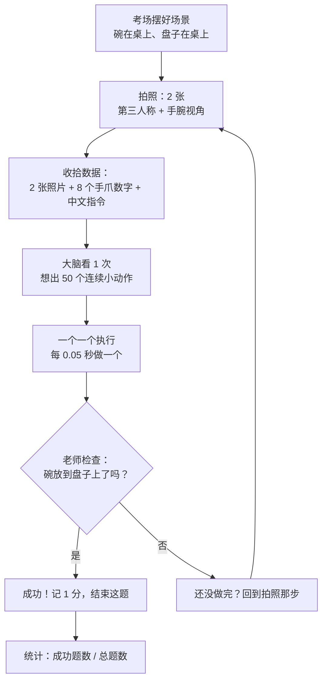

# 小白版：机器人在 LIBERO 里是怎么"考试"的

> 这份文档不讲代码，只讲**故事和数字**。看完你应该能对别人说清楚：
> "机器人看到什么 → 大脑想出什么 → 手怎么做 → 老师怎么打分"。

---

## 0. 一分钟版本

把它想象成**一场自动夹娃娃考试**：

```
考场：一个模拟的物理世界（有重力、会碰撞）—— MuJoCo
考题：桌上有个碗和盘子，把碗放到盘子上 —— LIBERO 出的题
考生：一个人工智能大脑 —— SmolVLA
老师：自动判卷机 —— LIBERO 的规则
```

流程就 4 句：

1. **看**：考场给考生 2 张照片 + 8 个手爪数字 + 一句中文指令。
2. **想**：大脑看一眼，一口气想出**接下来 50 个小动作**（不是 1 个）。
3. **做**：这 50 个小动作一个一个执行（每个占 0.05 秒，共 2.5 秒）。
4. **判**：老师随时检查"碗在盘子上了吗？"——是就成功，收工；否就继续看、继续做。

最后统计：10 道题里成功几道，就是成功率（比如 8/10 = 80%）。

---

## 1. 三个角色分别是谁

| 名字 | 通俗说法 | 它负责什么 |
|---|---|---|
| **MuJoCo / robosuite** | 物理考场 | 算重力、碰撞、摩擦；把画面渲染成照片 |
| **LIBERO** | 题库 + 判卷机 | 提供任务文件（碗放哪、盘子放哪）、固定初始摆放、判断成功与否 |
| **SmolVLA** | 考生的大脑 | 看图 + 读指令 → 输出动作。它不"懂"物理，只是**肌肉记忆** |
| **lerobot** | 考场工作人员 | 把三者接起来，跑完整个流程并记录成绩 |

一句话：**LIBERO 出题和判卷，MuJoCo 负责"真"物理，SmolVLA 只负责出动作。**

---

## 2. 完整流程（大白话版）



对应现实里的动作：

| 步骤 | 现实比喻 |
|---|---|
| 摆好场景 | 把人偶摆到起跑线上（每次摆放位置固定，保证公平） |
| 拍照 | 睁眼看一眼 |
| 收拾数据 | 把"看到的"整理成大脑能吃的格式 |
| 想 50 个动作 | **闭着眼睛**连做 50 个小动作 |
| 执行 1 个动作 | 手挪一点点（最多 5 厘米）或夹子动一下 |
| 老师检查 | 抬头看一眼"做到没" |

> **重点概念**：大脑不是"做一步看一步"，而是**一口气规划 50 步再执行**（术语叫"动作块 / action chunk"）。
> 好处是快（50 步只算 1 次），坏处是中途被撞跑了也不会立刻发现。

---

## 3. 机器人"看到"什么

一共 4 样东西：

### ① 2 张照片

| 照片 | 通俗说法 | 大小 |
|---|---|---|
| `agentview_image` | 旁边的摄像头拍的"全景" | 360×360 |
| `robot0_eye_in_hand_image` | 装在**手腕上**的摄像头，凑近看细节 | 360×360 |

进大脑前会被加工：**上下左右翻 180°**（模型训练时的约定）、缩放到 512×512、亮度从 0~1 变成 -1~1（siglip）。

### ② 8 个数字（"手爪体检报告"）

这就是那份看起来神秘的 8 维 `state`：

| 哪几个 | 含义 | 通俗解释 |
|---|---|---|
| 第 1~3 | 手爪位置 x, y, z | 手现在在哪 |
| 第 4~6 | 手爪朝向 | 手现在**拧成什么角度**（专业叫"轴角"） |
| 第 7~8 | 夹子开合 | 夹子张开多少 |

### ③ 一句中文指令

来自题目文件，例如：
`Pick the akita black bowl from table center and place it on the plate`
（把桌子中间的黑色碗放到盘子上）。会被切成 48 个词的 token 喂给大脑。

### ④ 还有一路"空照片"

大脑原本是在另一台机器人（SO-100）上训练的，那时候有 **3 个摄像头**。
现在 LIBERO 只提供 2 个，所以第 3 路塞一张**全黑/全空图**，并标记"这路不算数"。
👉 这就是命令里 `--policy.empty_cameras=1` 的作用，**不加会直接报错**。

---

## 4. 大脑"输出"什么

输出是 **7 个数字**（叫 action），像一个遥控手柄：

| 哪几个 | 含义 | 范围 |
|---|---|---|
| 第 1~3 | 手往 x / y / z 挪多少（**增量**，不是绝对位置） | 每一步最多 ±5 厘米 |
| 第 4~6 | 手腕转多少 | 每一步最多 ±0.5 弧度 |
| 第 7 | 夹子：夹紧还是松开 | -1 ~ 1 |

**"增量"是什么意思？** 不是说"手要跑到坐标 (0.3, 0.1, 0.9)"，而是"手**再往前挪 2 厘米**"。
所以每步都是小碎步，靠连续几十步凑成一个完整动作。

**一次想多少步？** 50 步。每个动作占 0.05 秒（20 Hz），所以一次思考管 2.5 秒。
一道题最多 280 步（约 14 秒），也就是最多"看" 6 次左右。

想的过程本身是"AI 画画"：先从一团随机噪声开始，反复擦改 **10 次**，逐渐擦出这 50 个动作。

---

## 5. 老师怎么判"成功"

判卷规则写在题目文件里。以第 1 题为例，题目文件最后写着：

```lisp
(:goal
  (And (On akita_black_bowl_1 plate_1))
)
```

翻译成人话：**碗要在盘子上**。判卷机把它拆成 3 个条件，**必须同时满足**：

| 条件 | 通俗解释 | 具体标准 |
|---|---|---|
| 高度 | 碗不能比盘子还高 | 碗的 z 坐标 ≤ 盘子的 z 坐标 |
| 接触 | 碗得真的搭在盘子上 | 两者有物理接触 |
| 距离 | 碗得大致在盘子中间 | 水平方向距离 **小于 3 厘米** |

三条全中 → 这一题算成功。判卷机**每一步都会查一次**，一旦成功立刻结束这题。

> 小知识：奖励只有"0 分"或"1 分"两种（成功给 1 分），不搞"59 分同情分"。

---

## 6. 成绩怎么算

| 名词 | 含义 |
|---|---|
| episode（回合） | 一道题做一次 |
| 一次评估 | 每道题做 `-n` 次，例如 `-n 1` 就是每道题做 1 次 |
| `libero_spatial` | 这套题一共 10 道 |
| 成功率 | 成功的回合数 ÷ 总回合数 |

实测结果就写在 `outputs/eval_ci/eval_info.json` 里，例如 `"pc_success": 100.0` 表示这道题 1 次就成功了。
视频存在 `outputs/eval_ci/videos/libero_spatial_<题号>/eval_episode_0.mp4`，**可以直接点开看它怎么做的**。

---

## 7. 三个常见疑问

**Q1：为什么明明写着 state 是 6 维，实际却是 8 维，还不报错？**
因为那个"6"是模型**出生证明**上抄来的旧信息（它原本是 SO-100 真机机器人，手爪只有 6 个数字）。
真正决定成败的是随模型一起保存的**"平均分/标准差"统计文件**，那份文件是拿 LIBERO 数据算的，本来就是 8 维。
所以：**说明书印错了一行字，但零件是按对的做的**。

**Q2：相机的"键名"为什么必须改？**
大脑只认 `camera1`、`camera2`、`camera3` 这三个名字。LIBERO 拍的照片叫 `agentview_image` 和 `robot0_eye_in_hand_image`。
名字对不上，大脑就去找 `camera1` 找不到 → 报 `Feature mismatch`。所以要改名（`camera_name_mapping`）+ 补一个空相机。

**Q3：流程图里照片是 360×360，说明书上却写 256×256，为什么也没报错？**
因为流程里会**统一缩放成 512×512** 再喂给大脑，所以原始尺寸是多少都无所谓。名字必须对上，尺寸不用。

---

## 8. 关键数字速查表

| 数字 | 含义 |
|---|---|
| **2** | 摄像头数量（另有 1 路空相机补充） |
| **8** | 手爪体检报告的维数 |
| **7** | 输出的动作维数 |
| **50** | 一次思考产出多少步动作 |
| **10** | "擦画"多少次（去噪步数） |
| **48** | 指令最多切多少个词 |
| **20 Hz** | 每秒执行 20 个动作（每个 0.05 秒） |
| **280** | `libero_spatial` 一道题最多走多少步（≈14 秒） |
| **0.05 米** | 手一步最多挪 5 厘米 |
| **0.03 米** | 判定成功时碗和盘子的水平距离上限 |

---

## 9. 想自己看一眼实锤？

项目根目录下依次运行（`ai312` 环境）：

```bash
# 看"碗放盘子上"这条判卷规则原文
sed -n '120,136p' ~/miniconda3/envs/ai312/lib/python3.12/site-packages/libero/libero/bddl_files/libero_spatial/pick_up_the_black_bowl_from_table_center_and_place_it_on_the_plate.bddl

# 看大脑出生证明（相机名、动作维数）
cat ~/.cache/huggingface/hub/models--lerobot--smolvla_libero/snapshots/*/config.json

# 看上次考试的成绩单
cat outputs/eval_ci/eval_info.json

# 看录像（本机没有图形界面就下载到本地看）
ls outputs/eval_ci/videos/
```

---

## 10. 术语对照 & 想深入时看哪里

| 术语 | 人话 |
|---|---|
| observation | 机器人看到的东西 |
| state | 手爪的"体检报告"（位置/朝向/夹子） |
| action | 机器人这一小步要做的动作 |
| action chunk | 一口气规划出来的一串动作（这里 50 个） |
| episode | 做一道题一次 |
| reward | 奖励，这里是"成功=1，失败=0" |
| policy | 策略，也就是"大脑"，这里指 SmolVLA |
| BDDL | LIBERO 用的题目文件格式（写明物件、摆放、判卷规则） |

想追代码时，按这个顺序读（都在 `lerobot/src/lerobot/` 下）：

| 文件 | 看什么 |
|---|---|
| `envs/libero.py` | 建考场、摆放、拍照整理、判成功、每题步数上限 |
| `envs/utils.py` | 把考场数据翻译成大脑能吃的格式 |
| `processor/env_processor.py` | 照片翻 180°、8 维手爪报告怎么拼出来 |
| `scripts/lerobot_eval.py` | 主循环：看 → 想 → 做 → 判 → 记分 |
| `policies/smolvla/modeling_smolvla.py` | 大脑内部：图片缩放、出队 50 步、10 次去噪 |

更技术性的完整拆解（带行号和函数名）见对话记录；本文只求"看懂"。

---

## 11. 数据集长什么样（在哪看）

先说清楚：**跑评估不需要数据集**，所以本机原来一个都没有。只有要训练 / 微调才用得上。
"数据集"其实有两个东西，别混：

| | A. LIBERO 题目/场景数据 | B. 训练数据集 `lerobot/libero` |
|---|---|---|
| 是什么 | 题面、初始摆放、3D 模型素材 | 1693 个回合的**人类示范录像 + 关节数值** |
| 在哪 | 已在本机（见附录 A） | HF 缓存，**默认只下了元数据** |
| 大小 | 题面几百 KB + 素材 334 MB | 共 **1.94 GB**（其中视频 1.9 GB） |
| 谁用 | 跑仿真时用 | 训练/微调用 |

### 11.1 训练数据集的目录结构（v3.0 规范）

```
~/.cache/huggingface/hub/datasets--lerobot--libero/snapshots/<版本哈希>/
├── README.md
├── meta/                                    ← 全部加起来只有 ~110 KB
│   ├── info.json                            ← 说明书：几个回合、几个字段、视频在哪
│   ├── stats.json                           ← 归一化用的均值/标准差
│   ├── tasks.parquet                        ← 40 道题的英文指令清单
│   └── episodes/chunk-000/file-000.parquet  ← 1693 行的回合索引表
├── data/chunk-000/file-000.parquet …        ← 377 个表，每行一帧，共 20 MB
└── videos/observation.images.image/chunk-000/file-000.mp4 …    ← 74 个视频，1.9 GB
    videos/observation.images.image2/chunk-000/file-000.mp4 …
```

`chunk-000` 是"分卷"：文件太多就按每 1000 个一卷（`chunks_size: 1000`）切开。

### 11.2 实测读出来的真实内容

**`meta/info.json`（说明书）**

```
codebase_version = v3.0      robot_type = panda
total_episodes = 1693        total_frames = 273465      total_tasks = 40      fps = 10
features:
  observation.images.image     video     [256, 256, 3]      ← 第三人称相机
  observation.images.image2    video     [256, 256, 3]      ← 手腕相机
  observation.state            float32   [8]                ← 手爪体检报告 8 维
  action                       float32   [7]                ← 动作 7 维
  timestamp / frame_index / episode_index / index / task_index
```

**`meta/tasks.parquet`（40 条指令，和仿真里的题面一一对应）**

```
put the white mug on the left plate and put the yellow and white mug on the right plate   0
put the white mug on the plate and put the chocolate pudding to the right of the plate     1
turn on the stove and put the moka pot on it                                              3
...
```

**`data/chunk-000/file-000.parquet`（843 行 × 7 列，843 帧 = 1 个回合）**

```
第 0 帧   episode=0  时间=0.0s
   state (8维): [-0.0534  0.0070  0.6783  3.1408  0.0018 -0.0899  0.0388 -0.0388]
   action(7维): [ 0.0161  0.0000 -0.0000  0.0000  0.0000 -0.0000 -1.0000]
第 100 帧 episode=0  时间=10.0s
   state (8维): [-0.0064 -0.2608  0.5791  3.0175  0.1379 -0.3110  0.0195 -0.0198]
   action(7维): [ 0.1554  0.1714  0.5009 -0.1200  0.0000 -0.0504 -1.0000]
```

> ⚠️ **反直觉的点**：这张表里**没有图片列**！图片全在 `videos/` 下。
> v3 版本只存数值，第几帧该取视频的第几秒，由 `meta/episodes/` 那张索引表告诉程序。

**`meta/episodes/chunk-000/file-000.parquet`（1693 行 × 14 列，每行一个回合）**

```
episode_index  length  dataset_from_index  dataset_to_index  data/chunk_index  data/file_index
      0         214            0                214                 0               0
      1         284           214               498                 0               0
                          videos/observation.images.image/chunk_index
                          videos/observation.images.image/file_index
                          videos/observation.images.image/from_timestamp → to_timestamp
                          （image2 同样 4 列）
```

**`meta/stats.json`（顺手解开了之前"6 维 vs 8 维"的疑问）**

```
observation.state: mean = [-0.0465 0.0344 0.7646 2.9722 -0.2205 -0.1256 0.0269 -0.0272]   ← 8 个数！
action:            mean = [ 0.0628 0.0868 -0.0904 0.0005  0.0056 -0.0052 -0.0496]        ← 7 个数
```

这份统计量就是模型文件里那套归一化数据的来源。它确实是 **8 维** → 所以"说明书印 6 维、
实际 8 维"能跑通，实锤（详见第 7 节 Q1）。

### 11.3 三种"看"的办法

```bash
# ① 最省事：网页上看文件树和 JSON 预览（不用下载）
#    https://huggingface.co/datasets/lerobot/libero/tree/main

# ② 只下元数据（~110 KB，本机已经下过）
~/miniconda3/envs/ai312/bin/python - <<'EOF'
from huggingface_hub import snapshot_download
print(snapshot_download("lerobot/libero", repo_type="dataset", allow_patterns=["meta/**"]))
EOF

# ③ 下全部 1.94 GB（真要训练时才需要）
hf download lerobot/libero --repo-type dataset
```

### 11.4 自己翻一翻

```bash
P=$(ls -d ~/.cache/huggingface/hub/datasets--lerobot--libero/snapshots/*)

# 说明书 / 题目清单 / 一帧数值
python -c "import json;print(json.dumps(json.load(open('$P/meta/info.json')),indent=2))"
python -c "import pandas as pd;print(pd.read_parquet('$P/meta/tasks.parquet').head(20))"
python -c "import pandas as pd;print(pd.read_parquet('$P/data/chunk-000/file-000.parquet').head())"
```

---

## 12. 附录 A：文件都放哪了（三个仓库地图）

**结论先行**：不是乱，是三个不同"仓库"按**"这东西归谁管"**分工。用手机打比方：

| 手机上的类比 | 电脑上的位置 | 规则 |
|---|---|---|
| 📱 已安装的 App 目录 | conda 环境 `site-packages` | 装出来的、只读、别手改 |
| 📂 手机缓存 / 下载目录 | `~/.cache/` | 程序自动下的、全局共享、删了会重下 |
| 🖥️ 你自己的办公桌 | `~/projects/robotics` | 你的东西、随便改、**唯一需要备份的** |

```
~/
│
├── miniconda3/envs/ai312/          【App 目录】pip/conda 装的 → 10 GB
│   └── lib/python3.12/site-packages/
│       ├── torch/ transformers/ numpy/ …            ← 各种库
│       ├── libero/libero/bddl_files/ init_files/    ← 题面 + 初始摆放（只读）
│       └── __editable__.lerobot-0.6.2.pth           ← 只一行字，指向下面那份源码 👇
│
├── .cache/                          【下载缓存】程序自动下的 → 3.5 GB + 334 MB
│   ├── huggingface/hub/            ← 模型权重、数据集（HF 官方约定）
│   ├── huggingface/xet/            ← 传输用的临时缓存
│   └── libero/assets/              ← LIBERO 的 3D 场景/物体/贴图 334 MB
│
└── projects/robotics/               【你的工作台】 → 412 MB
    ├── lerobot/                     ← LeRobot 源码本体（见下面"特例"）
    ├── scripts/  README.md  DATA_FLOW.md
    ├── outputs/                     ← 评估结果 + 视频
    └── requirements-ai312.txt       ← 重建环境的清单
```

### 为什么会出现"同一类东西在三处"？

| 现象 | 原因 |
|---|---|
| 题面 `.bddl` 在 **conda** 里 | `pip install` 的规矩就是把东西塞进环境目录；`hf-libero` 打包时顺手把题面也装进去了 |
| 3D 素材在 **cache** 里 | 同一个项目，但 334 MB 太大不适合塞进 pip 包 → 改成"首次运行时自己下载" |
| 模型/数据集在 **cache** 里 | HuggingFace 的通用约定：下下来的大文件都进 `~/.cache/huggingface/hub`，全局共享 |
| lerobot 源码在**项目里**，包却算在 conda | 它用的是 **editable 安装**（`pip install -e .`）：conda 里只登记了一个"快捷方式" |

**同一套东西被拆到两个地方，是打包的人做了两种选择，不是有统一规范** —— 这就是"感觉乱"的根源。

editable 安装的证据（可以直接自己看）：

```bash
$ cat .../site-packages/__editable__.lerobot-0.6.2.pth
~/projects/robotics/lerobot/src      ← 就这一行，是个"快捷方式"
$ python -c "import lerobot; print(lerobot.__file__)"
~/projects/robotics/lerobot/src/lerobot/__init__.py   ← 实际在项目里
```

好处：你可以直接改源码，改完立刻生效。

### 为什么 cache 里一个文件好像出现好几次？

```
snapshots/a1aaacb7…/meta/info.json  ->  ../../../blobs/2f28e991740c…   （软链接）
blobs/2f28e991740c…                    真文件，名字是内容哈希
refs/main                              记录"main 现在指向哪个版本"
```

| 层 | 作用 |
|---|---|
| `refs/` | 书签："main 分支 = 版本 a1aaacb7" |
| `snapshots/<版本哈希>/` | 那个版本的**目录树**（里面几乎都是软链接） |
| `blobs/<内容哈希>` | **真文件**，用内容命名 → 多版本共用一份，不重复占空间 |

所以**不是重复占用**，只是"快捷方式"多。

### 速查：要找什么去哪找

| 我想找… | 去哪 |
|---|---|
| 我的脚本 / 文档 / 评估结果 | `~/projects/robotics/scripts/`、`outputs/` |
| LeRobot 源码（想改/想看） | `~/projects/robotics/lerobot/src/lerobot/` |
| LIBERO 题面 `.bddl`、初始摆放 | `.../envs/ai312/lib/python3.12/site-packages/libero/libero/bddl_files/`、`init_files/` |
| 3D 场景素材 | `~/.cache/libero/assets/` |
| 模型权重 | `~/.cache/huggingface/hub/models--*/` |
| 训练数据集 | `~/.cache/huggingface/hub/datasets--lerobot--libero/` |
| 依赖清单（重建环境用） | `~/projects/robotics/requirements-ai312.txt` |

### 该不该动它？

| 位置 | 能改吗 | 删了会怎样 | 要备份吗 |
|---|---|---|---|
| 项目目录 | ✅ 随便改 | 你的成果没了 😱 | **要** |
| site-packages | ❌ 别手改 | 环境坏了，用 `requirements-ai312.txt` 重建 | 不用 |
| `~/.cache` | ⚠️ 别手动挑文件删 | 下次运行自动重下（费流量） | 不用 |

### 想自己定位任何东西

```bash
P="$HOME/miniconda3/envs/ai312/bin/python"

# 这个包到底在哪？
$P -c "import os; import lerobot, libero, torch; print('lerobot ->', os.path.dirname(lerobot.__file__)); print('libero  ->', os.path.dirname(libero.__file__)); print('torch   ->', os.path.dirname(torch.__file__))"

# 缓存根目录在哪（可以用 HF_HOME 改）
$P -c "from huggingface_hub import constants; print(constants.HF_HUB_CACHE)"
```

**嫌默认位置乱的话**，可以在 `~/.bashrc` 里把缓存挪到自己的盘：

```bash
export HF_HOME=/data/hf_cache          # 模型/数据集缓存
export HF_LEROBOT_HOME=/data/lerobot   # LeRobot 数据集缓存
```
