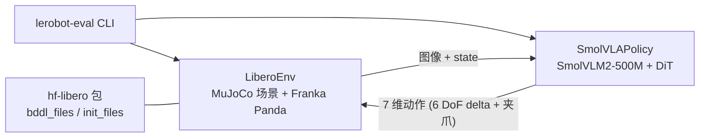

# SmolVLA + LIBERO

在本地 Linux 服务器（4× RTX 4090）上运行 **SmolVLA** 预训练策略，在 **LIBERO** 基准的 MuJoCo 仿真中评估。

---

## 快速开始

```bash
chmod +x scripts/run.sh

# 1) 环境自检（真建 LIBERO 环境、真跑 step）
bash scripts/run.sh scripts/check_env.py

# 2) 跑一次评估：libero_spatial 全部 10 个任务，每任务 1 episode
bash scripts/run.sh scripts/eval.py

# 常用变体
bash scripts/run.sh scripts/eval.py --suite libero_object -n 10   # 换套件 + 每任务 10 回合
bash scripts/run.sh scripts/eval.py --task-ids "[0]"              # 只跑 task 0
CUDA_VISIBLE_DEVICES=2 bash scripts/run.sh scripts/eval.py        # 指定显卡
LEROBOT_POLICY=lerobot/pi05_libero bash scripts/run.sh scripts/eval.py   # 换别的策略
python scripts/eval.py --help                                     # 查看全部可调参数
```

### 三种运行方式（效果完全一样）

`scripts/` 下的 Python 脚本都不依赖 `run.sh`：它们自己 `chdir` 到项目根、自己设
`MUJOCO_GL=egl` 和 `CUDA_VISIBLE_DEVICES`。所以下面三种写法等价，挑你顺手的：

```bash
# ① 用 run.sh（7 行薄壳，自动帮你选 ai312 解释器）—— 不用记路径，推荐
bash scripts/run.sh scripts/eval.py

# ② 写全解释器路径 —— 最直白，任何时候都能用
~/miniconda3/envs/ai312/bin/python scripts/eval.py

# ③ 先激活环境 —— 最符合科研界惯例（论文开源仓库通常就这么写）
conda activate ai312
python scripts/eval.py
```

> ⚠️ **不要直接敲 `python scripts/eval.py`**，除非你已经 `conda activate ai312`。
> 默认的 `(base)` 环境里没装 lerobot，会报：
>
> ```
> ❌ 找不到 lerobot-eval。请先执行：pip install -e lerobot
> ```
>
> 这不是脚本坏了，是解释器用错了 —— `which python` 看一眼就知道当前在哪个环境。

> 所有实验参数都在 `scripts/eval.py` 里用 argparse 定义（`python scripts/eval.py --help`），
> 改参数不用碰 shell。

实测结果（RTX 4090，单卡）：

```
Success rate 80.0% (8/10 episodes, 95% Wilson interval 49.0% to 94.3%)
eval_s: 93.6   eval_ep_s: 9.36   device: cuda
```

产出：

- 指标 → `outputs/eval_<套件>/eval_info.json`
- 每个任务一段 rollout 视频 → `outputs/eval_<套件>/videos/libero_spatial_<id>/eval_episode_0.mp4`

---

## 目录结构

```
robotics/
├── README.md               ← 本文件，唯一可信说明
├── .env                    ← 环境变量参考（注意：lerobot-eval 不会自动加载）
├── requirements-ai312.txt  ← 依赖清单 + 安装顺序
├── scripts/
│   ├── run.sh              ← 唯一的薄壳：切目录 + 设 MUJOCO_GL + 调 ai312 解释器
│   ├── check_env.py        ← 真实环境自检
│   └── eval.py             ← 评估入口（封装 lerobot-eval，参数见 --help）
├── lerobot/                ← LeRobot 源码本体，已 pip install -e 安装
│   └── .github/workflows/benchmark_tests.yml   ← 官方基准命令的来源，出问题先看这里
├── outputs/                ← 评估结果与视频
├── models/                 ← 空占位；权重实际由 HF 缓存提供
└── _archive/               ← 已废弃文件归档，可直接 rm -rf
```

**不存在的目录**：`libero/`（真正的 LIBERO 是 pip 包 `hf-libero`，装在 `site-packages/libero/`）。

---

## 运行链路



真正干活的是 `lerobot/` 这份源码 + pip 装的 `hf-libero`；`scripts/` 里的两个脚本只是薄封装。

---

## 环境

- 解释器：`~/miniconda3/envs/ai312/bin/python`
- 关键版本（2026-09-27 实测）：Python 3.12 / torch **2.11.0+cu126** / torchvision 0.26.0+cu126 /
  lerobot 0.6.2 / transformers 5.5.4 / mujoco 3.8.1 / robosuite 1.4.0 / hf-libero 0.1.4
- 重建方式见 `requirements-ai312.txt` 顶部注释

---

## 已知坑（都踩过了）

### 坑 1：CUDA 版本必须匹配驱动

GPU 驱动 `550.144.03` 支持的 CUDA 上限是 **12.4**。而 `pip install torch` 默认可能装到 `+cu130`，
那是给驱动 ≥ 580 的机器用的 → `torch.cuda.is_available()` 直接变 `False`。

```bash
# 正确做法（cu126 只要求驱动 >= 525）
pip install "torch==2.11.0+cu126" "torchvision==0.26.0+cu126" \
    --index-url https://download.pytorch.org/whl/cu126
```

> 注意：**不能用 cu124**，该索引最高只有 torch 2.6.0，而 lerobot 要求 `torch>=2.7`。

切换 torch 版本前，务必先停掉正在跑的训练/推理进程。

### 坑 2：`~/.libero/config.yaml` 缺失会卡住导入

缺这个文件时，`import libero.libero` 会执行 `input("Do you want to specify a custom path...")`，
非交互环境下抛 `EOFError`。用 `scripts/check_env.py` 会给出修复命令。

### 坑 3：SmolVLA 在 LIBERO 上需要相机映射 + 空相机

`lerobot/smolvla_libero` 的 `config.json` 继承自 `lerobot/smolvla_base`（SO-100 真机）的输入签名：

| | 策略要求 | LIBERO 实际提供 |
| --- | --- | --- |
| state | 6 维 | 8 维 |
| 相机 | `camera1` `camera2` `camera3`（256×256） | `image` `image2` |

所以必须加这两个参数，否则报 `ValueError: Feature mismatch`：

```bash
'--env.camera_name_mapping={"agentview_image": "camera1", "robot0_eye_in_hand_image": "camera2"}'
--policy.empty_cameras=1     # 补一个空的 camera3
```

`scripts/eval.py` 已自动加上（仅当 `--policy` 含 `smolvla` 时）。

### 坑 4：服务器必须设 `MUJOCO_GL=egl`

无显示器环境下不设会渲染失败。`scripts/run.sh` 与 `scripts/eval.py` 都已默认导出。

### 坑 5：不要相信"只查 import"的验证脚本

`import` 成功 ≠ 能跑。旧版 `verify_installation.py` 三项全 ✓，但实际上 CUDA 不可用、
LIBERO 建不了环境、模型特征不匹配。请用 `scripts/check_env.py`。

### 坑 6：`python scripts/eval.py` 报「找不到 lerobot-eval」

lerobot 只装在 `ai312` 环境里，而 shell 默认在 `(base)`。三种解法见上面「三种运行方式」。
排查命令：`which python`（看当前解释器）、`which lerobot-eval`（看有没有装上）。

---

## 手动运行（不用封装脚本）

```bash
cd "$HOME/projects/robotics"
export MUJOCO_GL=egl
PY="$HOME/miniconda3/envs/ai312/bin"

MUJOCO_GL=egl CUDA_VISIBLE_DEVICES=1 $PY/lerobot-eval \
  --policy.path=lerobot/smolvla_libero \
  --env.type=libero --env.task=libero_spatial \
  --eval.batch_size=1 --eval.n_episodes=10 \
  --eval.use_async_envs=false --policy.device=cuda \
  '--env.camera_name_mapping={"agentview_image": "camera1", "robot0_eye_in_hand_image": "camera2"}' \
  --policy.empty_cameras=1 \
  --output_dir=./outputs/eval_ci
```

常用参数：

| 参数 | 说明 |
| --- | --- |
| `--env.task` | `libero_spatial` / `libero_object` / `libero_goal` / `libero_10` / `libero_90` |
| `--env.task_ids=[0,1]` | 只跑指定任务；不加则跑该套件全部 |
| `--eval.n_episodes` | 每个任务跑几回合（复现基准用 10） |
| `--env.episode_length=300` | 限制单回合步数 |
| `--env.control_mode` | `relative`（默认）/ `absolute`，必须与策略训练时一致 |
| `--policy.n_action_steps` | 每次推理执行的动作数 |

其他可用策略（无需相机映射）：`lerobot/pi05_libero`、`lerobot/pi0fast-libero`、
`lerobot/xvla-libero`、`lerobot/MolmoAct2-LIBERO-LeRobot` 等。

查看全部参数：`$PY/lerobot-eval --help`

上面的每个 `lerobot-eval` 参数都对应 `scripts/eval.py` 里的一个 argparse 选项：

| `lerobot-eval` 参数 | `scripts/eval.py` 选项 |
| --- | --- |
| `--env.task` | `--suite` |
| `--eval.n_episodes` | `-n` / `--episodes` |
| `--env.task_ids` | `--task-ids` |
| `--policy.path` | `--policy` |
| `--policy.device` | `--device` |
| `--eval.batch_size` | `--batch-size` |
| `--output_dir` | `--output-dir` |

`--env.camera_name_mapping` 与 `--policy.empty_cameras` 无需手动传，脚本按策略名自动补齐。

---

## 相关上游文档

- `lerobot/docs/source/libero.mdx` —— LIBERO 评估/训练官方说明
- `lerobot/.github/workflows/benchmark_tests.yml` —— 官方 CI 的基准命令（本文命令的来源）
- `lerobot/docs/source/smolvla.mdx` —— SmolVLA 使用说明
