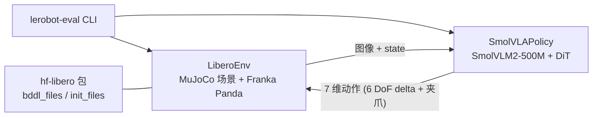

# SmolVLA + LIBERO

在本地 Linux 服务器（4× RTX 4090）上运行 **SmolVLA** 预训练策略，在 **LIBERO** 基准的 MuJoCo 仿真中评估，
并复现"从零微调到 70% 成功率"的完整消融实验。

> 🎯 **只想复现实验结果？** 直接跳到最后面的 **[消融实验复现](#消融实验复现从-0-到-70-的完整对照)** 一节，
> 里面有实验矩阵、逐步命令和每步的预期结果/耗时。
> 想先搞懂原理，再读 `DATA_FLOW.md`（评估侧）与 `TRAIN_FLOW.md`（训练侧）。

---

## 快速开始

```bash
chmod +x scripts/run.sh

# 1) 环境自检（真建 LIBERO 环境、真跑 step）
bash scripts/run.sh scripts/check_env.py

# 2) 跑一次评估：libero_spatial 全部 10 个任务，每任务 1 episode
bash scripts/run.sh scripts/eval.py

# 常用变体
bash scripts/run.sh scripts/eval.py --suite libero_object -n 10   # 换套件 + 每任务 10 回合
bash scripts/run.sh scripts/eval.py --task-ids "[0]"              # 只跑 task 0
CUDA_VISIBLE_DEVICES=2 bash scripts/run.sh scripts/eval.py        # 指定显卡
LEROBOT_POLICY=lerobot/pi05_libero bash scripts/run.sh scripts/eval.py   # 换别的策略
python scripts/eval.py --help                                     # 查看全部可调参数
```

### 三种运行方式（效果完全一样）

`scripts/` 下的 Python 脚本都不依赖 `run.sh`：它们自己 `chdir` 到项目根、自己设
`MUJOCO_GL=egl` 和 `CUDA_VISIBLE_DEVICES`。所以下面三种写法等价，挑你顺手的：

```bash
# ① 用 run.sh（7 行薄壳，自动帮你选 ai312 解释器）—— 不用记路径，推荐
bash scripts/run.sh scripts/eval.py

# ② 写全解释器路径 —— 最直白，任何时候都能用
~/miniconda3/envs/ai312/bin/python scripts/eval.py

# ③ 先激活环境 —— 最符合科研界惯例（论文开源仓库通常就这么写）
conda activate ai312
python scripts/eval.py
```

> ⚠️ **不要直接敲 `python scripts/eval.py`**，除非你已经 `conda activate ai312`。
> 默认的 `(base)` 环境里没装 lerobot，会报：
>
> ```
> ❌ 找不到 lerobot-eval。请先执行：pip install -e lerobot
> ```
>
> 这不是脚本坏了，是解释器用错了 —— `which python` 看一眼就知道当前在哪个环境。

> 所有实验参数都在 `scripts/eval.py` 里用 argparse 定义（`python scripts/eval.py --help`），
> 改参数不用碰 shell。

实测结果（RTX 4090，单卡）：

```
Success rate 80.0% (8/10 episodes, 95% Wilson interval 49.0% to 94.3%)
eval_s: 93.6   eval_ep_s: 9.36   device: cuda
```

产出（默认输出目录带时间戳，不同权重的结果不会混在一起）：

- 指标 → `outputs/eval_<套件>/<日期>/<时间>_n<每任务回合数>/eval_info.json`
- 每个任务一段 rollout 视频 → 同目录下 `videos/libero_spatial_<id>/eval_episode_0.mp4`

> 想固定输出目录就加 `--output-dir outputs/eval_xxx`；此时脚本会先清掉该目录里
> 上一次的 `eval_info.json` / `videos/` / `recordings/` 再跑（因为 lerobot 只覆盖本轮要写的文件、
> 从不清理旧文件，固定目录很容易把两次不同权重的产物混在一起）。

---

## 训练（微调自己的模型）

评估是「考别人训好的模型」，训练是「自己训」。三步：

```bash
# 1) 下资产：LIBERO 数据集(~1.9GB) + smolvla_base 基线权重(~0.9GB)
bash scripts/run.sh scripts/download_assets.py
bash scripts/run.sh scripts/download_assets.py --check   # 只体检，不下载

# 2) 冒烟测试：4 步 / batch 2 / 只取 4 个 episode，先确认链路能跑通
bash scripts/run.sh scripts/train.py --tmp-run

# 3) 正式微调
bash scripts/run.sh scripts/train.py --official-recipe   # 一键复刻官方配方（25000 步 / 全参数微调）
bash scripts/run.sh scripts/train.py --steps 50000 --batch-size 16 --save-freq 1000   # 自定义超参
# 不带 -g 会自动选空闲显存最多的卡；要写死用 -g 1（别写死 -g 0，见「环境 → GPU」）
```

产出：

- 权重 → `outputs/train/<日期>/<时间>_<job_name>/checkpoints/<步数>/pretrained_model/`
- `checkpoints/last` 是指向最新一份的符号链接
- 该次训练的全部超参 → 同目录的 `train_config.json`（续训就靠它）

训练完的模型直接喂给评估脚本：

```bash
bash scripts/run.sh scripts/eval.py \
  --policy outputs/train/2026-09-29/12-00-00_smolvla_libero/checkpoints/last/pretrained_model -n 10
```

常用参数（全部见 `python scripts/train.py --help`）：

| 参数 | 说明 |
| --- | --- |
| `-g / --gpu` | 用哪张卡；**默认自动选空闲显存最多的卡**（多人共用机器，别写死 `-g 0`） |
| `--steps` | 优化步数（**不是** epoch），默认 20000 |
| `--batch-size` | 每卡 micro-batch，默认 **32**（4090 48G 实测吞吐甜点；显存紧张再往下调） |
| `--save-freq` | 每多少步存一次，默认 2000 |
| `--lr` | 即 `--policy.optimizer_lr`，默认 1e-4（设 0 = 沿用权重预设） |
| `-n / --num-workers` | DataLoader worker 数，默认 4（实测加到 12 吞吐不变） |
| `--official-recipe` | **一键复刻官方配方**：25000 步 / batch 32 / 全参数微调 / 路线 B |
| `--tmp-run` | 冒烟测试：4 步 / batch 2 / 只取 4 个 episode |
| `--dry-run` | 只打印将执行的 lerobot-train 命令 |
| `--resume-from` | 续训，指向 `<ckpt>/train_config.json` |
| `--rename-map` | 换用官方 rename_map 路线（见坑 8） |

没被 `train.py` 收录的 lerobot-train 参数可以**直接追加**，脚本原样透传：

```bash
bash scripts/run.sh scripts/train.py -g 0 -- --accelerator.mixed_precision=bf16
```

### 实测性能（2026-09-29，RTX 4090 48GB，单卡）

| batch | num_workers | 显存 | step_s | samples/s |
| --- | --- | --- | --- | --- |
| 2 | 4 | 1.69 GB | 0.103 | 19 |
| 32 | 4 | 7.68 GB | 0.265 | **122** |
| 64 | 4 | 14.05 GB | 0.524 | **122**（无提升） |
| 32 | 12 | 7.69 GB | 0.264 | 121（无提升） |

结论：

- **`--batch-size 32` 就是甜点**（也是 `train.py` 的默认值）。加到 64 只会把显存翻倍、
  每步时间翻倍，吞吐一点不涨。
- **加 `--num-workers` 没用**：实测 4 → 12 吞吐不变。
- 瓶颈是 **GPU 算力本身**，不是数据加载。日志里 `data_s≈0.001s` 而 `updt_s≈0.258s`
  —— dataloader 一直跑在前面。（首步 `data_s≈1.2s` 是冷启动，正常。）
- **20000 步的预估耗时 ≈ 20000 × 0.265 s ≈ 1.5 小时**（单卡）。
- 只有 `--batch-size 2` 这种小 batch 才明显吃亏（吞吐只有 1/6），别用它来做正式训练。
- 可训练参数 100M / 总参数 450M（`freeze_vision_encoder=true` + `train_expert_only=true`）。

> ⚠️ 上面的数字是在**空闲卡**上测的。这台机器多人共用，跑之前先确认卡的余量（见「环境 → GPU」）。

> 续训和「重新微调」是**两套不同东西**，别混：
> - `--resume-from <ckpt>/train_config.json` → 恢复 optimizer / scheduler / RNG / step，接着上次训
> - `--policy <别的权重> --output-dir <新目录>` → 从某个权重**重新开始**一次训练
>
> 两者互斥；`--resume-from` 还要求 `--output_dir` 指向的那次记录能被找到。

---

## 消融实验复现（从 0% 到 70% 的完整对照）

> 这一节是本项目**最重要**的内容：把"为什么是 70% 而不是 80%"拆成可复现的对照实验。
> 下面每条命令都可直接复制粘贴，每步都给出**预期结果**与**耗时**，跑完能和矩阵表逐行对上。
> 背后的原理（接口适配、归一化统计量、冻结开关的真实含义）在 `TRAIN_FLOW.md` 里，本文只讲怎么跑。

### 一、实验矩阵

三个消融维度：**训练步数**（A）、**冻结策略**（B）、**评测套件**（C）。
下表的每个数字都取自实际落盘的 `eval_info.json` / `train_config.json`。

| # | 实验 | 训练量 | 冻结策略 | 可训/总参数 | 套件 | 每任务回合 | 成功率 | `eval_ep_s` | 产物目录 |
|---|---|---|---|---|---|---|---|---|---|
| 0 | base 零样本（未微调） | 0 步 | — | — | libero_spatial | 1 | 0/10（0%） | 14.32 | `outputs/eval_base/` |
| 1 | 冒烟产物 | 4 步 / 8 样本 | expert-only | 100M / 450M | libero_spatial | 10 | 0/100（0%） | 26.48 | `outputs/train/_smoke/` |
| 2 | pilot | 30 步 / 960 样本 | 全参数 | 393M / 450M | libero_spatial | 1 | 0/10（0%） | 15.31 | `outputs/eval_pilot30/` |
| 3 | **主结果（A↑）** | 25000 步 / 80 万样本 | **全参数** | 393M / 450M | libero_spatial | 1 | **7/10（70%）** | **10.04** | `outputs/eval_libero_spatial/` |
| 4 | **消融 B（冻结）** | 25000 步 / 80 万样本 | **expert-only** | 100M / 450M | libero_spatial | 1 | 6/10（60%） | 13.21 | `outputs/expert_only_25k/` |
| 5 | **消融 C（换套件）** | 同 #4 权重 | expert-only | 100M / 450M | libero_goal | 1 | 7/10（70%） | 8.18 | `outputs/expert_only_25k_goal/` |
| 6 | 官方对照 | — | 全参数 | 393M / 450M | libero_spatial | 1 | 8/10（80%） | 9.91 | `outputs/eval_baseline.log` |

**三条结论：**

1. **维度 A（步数）**：0 / 4 / 30 步全是 0%，只有 25000 步才到 70%
   ⇒ "没训练够"是 0% 的第一层原因。
2. **维度 B（冻结策略，唯一变量）**：同样 25000 步、同样 batch 32、同一份数据，
   只把 `freeze_vision_encoder` 与 `train_expert_only` 从 `false` 改回 `true`
   （可训参数 393M → 100M，耗时 ×0.37），成功率 70% → 60%
   ⇒ **解冻整个 VLM 做全参数微调，值那 2.2× 的算力开销。**
3. **维度 C（套件）**：同一个 expert-only 权重，spatial 60% / goal 70%。
   注意 10 回合的统计噪声很大，别把 10pp 的差当真实差距（见下）。

> ⚠️ **统计口径**：矩阵里全部是 **每任务 1 回合**（10 回合/套件），
> 95% Wilson 置信区间宽达 `[40%, 89%]`。这是为快速对照做的估算。
> **正式写论文请用 `-n 10`**（下面的"严谨版"命令），并重复 3 个随机种子。

### 二、复现前提

```bash
cd ~/projects/robotics          # 本文件所有相对路径都相对项目根
chmod +x scripts/run.sh
```

- **环境**：conda 环境 `ai312`（含 lerobot 0.6.2 editable），详见「环境」一节。
- **显存**：全参数 25000 步约需 **28 GB**；expert-only 约需 **7.7 GB**。
  这台机器多人共用，跑前先看一眼：
  ```bash
  nvidia-smi --query-gpu=index,memory.free --format=csv
  ```
- **时间**：全参数 25k ≈ **4 小时**；expert-only 25k ≈ **1.5 小时**（皆单卡 4090）。
- **磁盘**：数据集 ~1.9 GB + 权重 ~0.9 GB + 两次训练的 checkpoint（每个 5 份 × ~1.8 GB）。

### 步骤 1 · 下载资产（一次性）

```bash
bash scripts/run.sh scripts/download_assets.py            # 数据集 ~1.9GB + 基线权重 ~0.9GB
bash scripts/run.sh scripts/download_assets.py --check    # 体检：74 个视频分片 + stats.json + 3D 资产
```

预期：`datasets/libero/`（1693 episodes / 273465 frames / 40 tasks）与 `models/smolvla_base/`。
两个目录都已被 `.gitignore` 忽略（不进 git）。

### 步骤 2 · 环境自检

```bash
bash scripts/run.sh scripts/check_env.py
```

预期：真建 LIBERO 环境、真跑一次 `step()`，末尾全绿。（只检查 `import` 的旧脚本不可信，见坑 5。）

### 步骤 3 · 复现 #0：base 零样本（0 步）

```bash
bash scripts/run.sh scripts/eval.py \
  --policy models/smolvla_base --suite libero_spatial -n 1 \
  --output-dir outputs/eval_base
```

预期：**成功率 0%**（`outputs/eval_base/eval_info.json` 里 `overall.pc_success = 0.0`）、
`eval_ep_s ≈ 14.3`。这一步证明"**不微调就是不行**"。

> `eval.py` 会自动读 `models/smolvla_base/config.json`，据此补上
> `--env.camera_name_mapping` 和 `--policy.empty_cameras=1`，无需手动传。

### 步骤 4 · 复现 #1：4 步冒烟（只为验证链路，不产生有效模型）

```bash
bash scripts/run.sh scripts/train.py --official-recipe --tmp-run --job-name _smoke
```

预期：4 步 / batch 2 / 8 个样本，几秒结束，`num_learnable_params=392904096`。
产物 `outputs/train/_smoke/`。评估它必然 0%（只见过 4 条轨迹）——
本步只为确认「训练 → checkpoint → 评估」这条路能走通。

### 步骤 5 · 复现 #3：主结果（全参数 25000 步，官方配方）

长跑务必**脱离终端**（关掉 VS Code / SSH 断开 / Ctrl-C 都会把它带走，见 `scripts/train.py` 头注释方式 1/2）：

```bash
cd ~/projects/robotics
PYTHONUNBUFFERED=1 nohup bash scripts/run.sh scripts/train.py --official-recipe \
  --job-name smolvla_libero --output-dir outputs/train/fullparam_25k \
  > outputs/train_fullparam_25k.log 2>&1 &
echo "PID=$!"
```

`--official-recipe` 会展开成：`steps=25000 / batch_size=32 / save_freq=5000 / log_freq=200 /
num_workers=4`，走路线 B（`rename_map`），并覆盖三个 policy 字段：

```
--policy.freeze_vision_encoder=false      # 解冻视觉编码器
--policy.train_expert_only=false          # 解冻整个 VLM（= 全参数微调）
--policy.scheduler_decay_steps=25000      # 与 steps 对齐，余弦才能退火到底
```

**预期（实测值，用于对答案）：**

| 指标 | 期望值 |
| --- | --- |
| `num_learnable_params` | `392,904,096`（总数 450,046,176） |
| `mem_gb` | ≈ 28.30 |
| `smp/s` / `updt_s` | ≈ 56 / 0.56 |
| 末步日志 | `loss:0.309 lr:2.5e-06`（lr 刚好退火到 `decay_lr`） |
| 总耗时 | ≈ **4 小时 03 分** |

训练完成后评估：

```bash
bash scripts/run.sh scripts/eval.py \
  --policy outputs/train/fullparam_25k/checkpoints/last/pretrained_model \
  --suite libero_spatial -n 1 \
  --output-dir outputs/eval_fullparam_25k
```

预期：**7/10（70%）**、`eval_ep_s ≈ 10.0`。

> 严谨版：`-n 10`，并加 `-- --seed 2000` 之类换种子复跑。

### 步骤 6 · 复现 #4：消融 B —— 唯一变量 = 冻结策略（expert-only 25000 步）

与步骤 5 **完全相同的命令**，只在**末尾**追加两个 flag，把预设里的 `false` 覆盖回 `true`：

```bash
cd ~/projects/robotics
PYTHONUNBUFFERED=1 nohup bash scripts/run.sh scripts/train.py --official-recipe \
  --job-name expert_only_25k --output-dir outputs/train/expert_only_25k \
  --policy.freeze_vision_encoder=true --policy.train_expert_only=true \
  > outputs/train_expert_only_25k.log 2>&1 &
echo "PID=$!"
```

> **为什么必须放末尾**：`--official-recipe` 自己会追加
> `--policy.freeze_vision_encoder=false`，于是命令行里同一字段出现两次，
> 而 **draccus 取最后一个** ⇒ 末尾的 `=true` 生效。
> 这是做"唯一变量"对照的关键 —— 位置写错就会变成重复主实验（可以先 `--dry-run` 打印命令核对）。

**预期（实测值）：**

| 指标 | 全参数（步骤 5） | expert-only（本步） |
| --- | --- | --- |
| `num_learnable_params` | 392,904,096 | **99,880,992** |
| `mem_gb` | 28.30 | **7.68** |
| `smp/s` | 56 | **118 ~ 122** |
| 总耗时 | ≈ 4h03m | ≈ **1 小时 30 分** |

评估：

```bash
bash scripts/run.sh scripts/eval.py \
  --policy outputs/train/expert_only_25k/checkpoints/last/pretrained_model \
  --suite libero_spatial -n 1 \
  --output-dir outputs/expert_only_25k
```

预期：**6/10（60%）**、`eval_ep_s ≈ 13.2`。与步骤 5 的 70% 相比即得维度 B 的结论。

### 步骤 7 · 复现 #5：消融 C —— 同一权重换套件（libero_goal）

`libero_goal` 需要额外的 3D 物体资产（`~/.cache/libero/assets/turbosquid_objects/`，
不在项目内、不受 git 管理）。若 `--check` 报缺，先补（**幂等**，只补缺的、单个失败不打断整批）：

```bash
bash scripts/run.sh scripts/download_assets.py --only assets
```

> 坑：libero 自带的"已下载"判定只看 4 个目录**是否存在**、不看内容，
> 代理掐断后会一直打印「Assets already downloaded」跳过，
> 直到 `env.reset()` 抛 `FileNotFoundError`。用上面的命令按远端清单逐文件补。

评估同一个 expert-only 权重：

```bash
bash scripts/run.sh scripts/eval.py \
  --policy outputs/train/expert_only_25k/checkpoints/last/pretrained_model \
  --suite libero_goal -n 1 \
  --output-dir outputs/expert_only_25k_goal
```

预期：**7/10（70%）**、`eval_ep_s ≈ 8.2`。

### 步骤 8 · 汇总对比

```bash
cd ~/projects/robotics
python - <<'PY'
import json, glob
print(f"{'run':<42s} {'success':>9s} {'rate':>7s} {'s/ep':>7s}")
for f in sorted(glob.glob("outputs/*/eval_info.json")):
    o = json.load(open(f))["overall"]
    print(f"{f:<42s} {o['n_success']:>4d}/{o['n_episodes']:<4d} "
          f"{o['pc_success']:>6.1f}% {o['eval_ep_s']:>6.2f}")
PY
```

把输出与「一、实验矩阵」逐行对照即可。**判断某次评估到底产出了什么，
以 `<输出目录>/eval_info.json` 的 `video_paths` 为准**，不要数 `videos/` 里的文件个数
（原因见「快速开始 → 产出」）。

### 三、想跑自己的消融？

`--official-recipe` 是基线，要改哪一项就把它**追加在命令末尾**（同一字段后者覆盖前者）：

| 想改什么 | 加什么参数 |
| --- | --- |
| 训练步数 | `--steps 10000` |
| 只训 action expert（冻住整个 VLM） | `--policy.train_expert_only=true` |
| 冻结视觉编码器 | `--policy.freeze_vision_encoder=true` |
| 不训 state 投影 | `--policy.train_state_proj=false` |
| 学习率 | `--lr 5e-5` |
| batch 大小 | `--batch-size 16` |
| 混合精度 | `-- --accelerator.mixed_precision=bf16` |
| 换随机种子 | `-- --seed 2000` |
| 换数据集（如子集） | `--dataset.episodes=[0,1,2,3]`（**别加引号**，见坑 12） |

> 任何 `train.py` 没收录的 `lerobot-train` 参数，都可以用 `-- <参数>` 原样透传。

---

## 目录结构

```
robotics/
├── README.md               ← 本文件，唯一可信说明
├── DATA_FLOW.md            ← 评估侧讲解（机器人是怎么在 LIBERO 里"考试"的）
├── TRAIN_FLOW.md           ← 训练侧复盘（怎么把 base 从 0% 调到 70%）
├── .env.example            ← 环境变量样例（真正的 .env 已被 gitignore）
├── requirements-ai312.txt  ← 依赖清单 + 安装顺序
├── scripts/
│   ├── run.sh              ← 唯一的薄壳：切目录 + 设 MUJOCO_GL + 调 ai312 解释器
│   ├── check_env.py        ← 真实环境自检
│   ├── download_assets.py  ← 下训练用的数据集 + 基线权重（幂等，可 --check 只体检）
│   ├── train.py            ← 训练入口（封装 lerobot-train，参数见 --help）
│   ├── eval.py             ← 评估入口（封装 lerobot-eval，参数见 --help）
│   └── live_view.py        ← eval.py --view 的 Tkinter 贴图窗口
├── lerobot/                ← LeRobot 源码本体，已 pip install -e 安装
│   └── .github/workflows/benchmark_tests.yml   ← 官方基准命令的来源，出问题先看这里
├── datasets/               ← 训练数据集（download_assets.py 落地，~1.9GB，已 gitignore）
├── outputs/                ← 评估结果与视频；训练 checkpoint 在 outputs/train/
├── models/                 ← 基线权重落地处（download_assets.py 落地，已 gitignore）
└── _archive/               ← 已废弃文件归档，可直接 rm -rf
```

**不存在的目录**：`libero/`（真正的 LIBERO 是 pip 包 `hf-libero`，装在 `site-packages/libero/`）。

---

## 运行链路



真正干活的是 `lerobot/` 这份源码 + pip 装的 `hf-libero`；`scripts/` 里的脚本只是薄封装。

训练链路就是在上面这条链路上把 `lerobot-eval` 换成 `lerobot-train`：
`LiberoDataset(mp4 解码)` → `SmolVLAPolicy` 前向 → 算 loss → 反向更新，
checkpoint 落到 `outputs/train/`。训练时不做仿真评测（`--env_eval_freq=0`），
所以 MuJoCo 那条支路是关的。

---

## 环境

- 解释器：`~/miniconda3/envs/ai312/bin/python`
- 关键版本（2026-09-27 实测）：Python 3.12 / torch **2.11.0+cu126** / torchvision 0.26.0+cu126 /
  lerobot 0.6.2 / transformers 5.5.4 / mujoco 3.8.1 / robosuite 1.4.0 / hf-libero 0.1.4
- 重建方式见 `requirements-ai312.txt` 顶部注释

### GPU（2026-09-29 实查，**与早期文档不符，以此为准**）

```
index  name             memory.total   memory.used
  0    RTX 4090         49140 MiB      34800 MiB   ← 别人的任务占着
  1    RTX 4090         49140 MiB         17 MiB   ← 空
  2    RTX 4090         49140 MiB       8188 MiB
  3    RTX 4090         49140 MiB         16 MiB   ← 空
```

- 是 **RTX 4090 48GB 版**（49140 MiB），**不是 24GB**。
- 机器**多人共用**：GPU 0 上长期跑着别的用户（`lxc`）的 `python unet-mipinn.py`，
  已持续 5 天、占 33.6 GB；GPU 2 上也有别人的进程。
  所以 **不要写死 `-g 0`** —— 实测在 GPU 0 上跑 `--batch-size 64`（约需 15 GB）
  会因为只剩 13.8 GB 直接 `torch.OutOfMemoryError`。
- `scripts/train.py` 默认**自动选空闲显存最多的卡**（查 `nvidia-smi`），要指定就用 `-g`。
  跑之前先看一眼：`nvidia-smi --query-gpu=index,memory.free --format=csv`

---

## 已知坑（都踩过了）

### 坑 1：CUDA 版本必须匹配驱动

GPU 驱动 `550.144.03` 支持的 CUDA 上限是 **12.4**。而 `pip install torch` 默认可能装到 `+cu130`，
那是给驱动 ≥ 580 的机器用的 → `torch.cuda.is_available()` 直接变 `False`。

```bash
# 正确做法（cu126 只要求驱动 >= 525）
pip install "torch==2.11.0+cu126" "torchvision==0.26.0+cu126" \
    --index-url https://download.pytorch.org/whl/cu126
```

> 注意：**不能用 cu124**，该索引最高只有 torch 2.6.0，而 lerobot 要求 `torch>=2.7`。

切换 torch 版本前，务必先停掉正在跑的训练/推理进程。

### 坑 2：`~/.libero/config.yaml` 缺失会卡住导入

缺这个文件时，`import libero.libero` 会执行 `input("Do you want to specify a custom path...")`，
非交互环境下抛 `EOFError`。用 `scripts/check_env.py` 会给出修复命令。

### 坑 3：SmolVLA 在 LIBERO 上需要相机映射 + 空相机

`lerobot/smolvla_libero` 的 `config.json` 继承自 `lerobot/smolvla_base`（SO-100 真机）的输入签名：

| | 策略要求 | LIBERO 实际提供 |
| --- | --- | --- |
| state | 6 维 | 8 维 |
| 相机 | `camera1` `camera2` `camera3`（256×256） | `image` `image2` |

所以必须加这两个参数，否则报 `ValueError: Feature mismatch`：

```bash
'--env.camera_name_mapping={"agentview_image": "camera1", "robot0_eye_in_hand_image": "camera2"}'
--policy.empty_cameras=1     # 补一个空的 camera3
```

> `scripts/eval.py` 现在**读权重自己的 `config.json`** 来决定要不要加这两个参数：
> `lerobot/smolvla_libero` 声明 `camera1/2/3` → 自动加；`lerobot/pi05_libero` 声明
> `image/image2` → 一个都不加；你自己用路线 A 训出来的产物声明 `image/image2` → 也不加。
> 详见坑 8。

请注意这里的两层「改名」是**不同机制、作用在不同环节**：

| | 键名 | 作用对象 | 何时用 |
| --- | --- | --- | --- |
| `--env.camera_name_mapping` | 环境原始相机名（`agentview_image`） | **评估**时的环境观测 | 权重期望 `camera1/2/3` 时 |
| `--rename_map` | `observation.images.*` 数据/环境键 | **训练**时的数据集 | 权重期望的键 ≠ 数据集的键时 |

### 坑 4：服务器必须设 `MUJOCO_GL=egl`

无显示器环境下不设会渲染失败。`scripts/run.sh` 与 `scripts/eval.py` 都已默认导出。

### 坑 5：不要相信"只查 import"的验证脚本

`import` 成功 ≠ 能跑。旧版 `verify_installation.py` 三项全 ✓，但实际上 CUDA 不可用、
LIBERO 建不了环境、模型特征不匹配。请用 `scripts/check_env.py`。

### 坑 6：`python scripts/eval.py` 报「找不到 lerobot-eval」

lerobot 只装在 `ai312` 环境里，而 shell 默认在 `(base)`。三种解法见上面「三种运行方式」。
排查命令：`which python`（看当前解释器）、`which lerobot-eval`（看有没有装上）。
`scripts/train.py` 同理，只是把 `lerobot-eval` 换成 `lerobot-train`。

### 坑 7：HF 缓存里的 `lerobot/libero` **没有 videos/**

`~/.cache/huggingface/hub/datasets--lerobot--libero` 那份只下了 `meta/` + `data/`，
**没有 `videos/`**（旧文档 §11.3 把「下全部 1.9GB」列为"真要训练时才需要"，所以确实没做过）。
而训练是**按 mp4 逐帧解码取图**的 —— 缺视频直接跑不起来。

另外 lerobot 默认下载走的是 `~/.cache/huggingface/lerobot/hub/`（`HF_LEROBOT_HOME` 决定），
跟上面那个 `$HF_HOME/hub/` 不是同一处，所以**不显式给 `--dataset.root` 会重复下载**。

`scripts/download_assets.py` 就是来解决这两件事的：用 `snapshot_download(local_dir=...)`
把数据集和权重都落进**项目内**（`datasets/`、`models/`），路径稳定、自包含。
体检命令：`bash scripts/run.sh scripts/download_assets.py --check`。

### 坑 8：权重写死的相机键名 ≠ 数据集的相机键名

`lerobot/smolvla_base` 的 `config.json` 把输入签名写死成
`observation.images.camera1 / camera2 / camera3`，而 `lerobot/libero` 给的是
`observation.images.image / image2`。lerobot 的 `make_policy` 只在策略 config 的
`input_features` **为空**时才从数据集推断，而 smolvla_base 的 `input_features` 非空
→ camera1/2/3 会被保留 → `prepare_images()` 在 batch 里一个相机都找不到，直接报：

```
ValueError: All image features are missing from the batch.
```

两条官方解法（都在 lerobot 自带文档/测试里验证过）：

| 路线 | 做法 | 代价 |
| --- | --- | --- |
| **A（`train.py` 默认）** | `--policy.input_features=null --policy.output_features=null`，让特征从数据集推断，键名保持 `image/image2` | 无。评估时零配置，直接配 `--env.type=libero`。官方 PEFT 文档「Training SmolVLA on the libero dataset」同款 |
| **B（加 `--rename-map`）** | `--rename_map='{"observation.images.image": "observation.images.camera1", ...}'` | 对齐 `lerobot/smolvla_libero` 血统；但要同时在评估/仿真评测里给 `--env.camera_name_mapping` |

> `scripts/eval.py` 现在会**读权重的 `config.json`** 自动判断该不该加映射参数
> （以前是靠 `"smolvla" in 路径` 猜，对 `outputs/train/smolvla_libero/...` 会误加）。
> 所以路线 A、路线 B、`lerobot/smolvla_libero`、`lerobot/pi05_libero` 都能直接评估。

**维度差异不用担心**：state 6 vs 8、action 6 vs 7。SmolVLA 的
`state_proj` / `action_in_proj` / `action_out_proj` 都是 `Linear(max_state_dim=32, ·)`
且有 `pad_vector()`，差异被 padding 吸收；`output_features` 无论如何都会被数据集覆盖；
归一化统计量在训练时会被 `lerobot_train.py` 强制覆写成**数据集**的 stats
（跳过 checkpoint 里的旧 stats），所以权重的 6 维统计量不会污染训练。

### 坑 9：`output_dir` 已存在会直接报错；续训要换参数

lerobot 对已存在的 `output_dir` 会抛 `FileExistsError`（防止覆盖旧实验）。
`scripts/train.py` 的默认输出目录带时间戳，不会撞；但手动指定 `--output-dir` 时要当心
（脚本会在开跑前提前用友好文案拦住，并提示改用 `--resume-from`）。

续训要传 `--resume-from <ckpt>/train_config.json`（**不能**同时传 `--policy` 换权重）。

为什么「不能同时传」——`TrainPipelineConfig._resolve_pretrained_from_cli()` 的优先级是
**`--reward_model.path` > `--policy.path` > `--resume`**。只要命令行里出现了
`--policy.path`，`_resolve_resume_checkpoint()` 就**永远不会被执行**，续训静默失效
（不报错，只是从头训）。上游官方续训测试（`lerobot/Makefile:test-act-ete-train-resume`）
也只有两行：

```bash
lerobot-train \
  --config_path=<ckpt>/pretrained_model/train_config.json \
  --resume=true
```

同理，续训时**不要**再传 `--steps` / `--batch_size` / `--output_dir` 等：它们会覆盖
checkpoint 里 `train_config.json` 记录的值。比如原实验跑 50000 步，续训时用默认的
`--steps=20000` 会把实验**截断**。所以 `scripts/train.py --resume-from` 只发那两个参数，
并打印显式告警；真需要改的请追加在命令末尾原样透传。

### 坑 10：`--policy.path` 传 HF repo id 会把权重重下一遍

`lerobot/smolvla_base` 是 **repo id**，lerobot 就会去 HF 缓存（`~/.cache/huggingface/hub/`）
解析权重；而 `download_assets.py` 是把权重落在**项目内** `models/smolvla_base/` 的，
缓存里那份只有 `config.json` → 于是它把已经下好的 **907MB 重新下一遍**
（实测 788 kB/s，还走 xet，能卡死）。

`scripts/train.py` 和 `scripts/eval.py` 都有 `resolve_policy()` 自动处理：只要
`models/<名字>/` 下有完整的 `config.json` + `model.safetensors`，就把 repo id 改指本地目录，
摘要里会显示 `[本地目录（由 lerobot/smolvla_base 解析而来）]`。

> 手写 `lerobot-train` 命令时请直接写本地路径：`--policy.path=models/smolvla_base`。

### 坑 11：`HF_HUB_DISABLE_XET=1` 必须传进子进程

xet 传输在本机的 HTTP 代理（`127.0.0.1:1080`）下会**挂死在 0 字节且不报任何错** —— 只是永远不动。
只在 shell 里 `export` 不够（脚本自己 spawn 子进程时可能丢）。所以
`download_assets.py` / `train.py` / `eval.py` 都用 `os.environ.setdefault("HF_HUB_DISABLE_XET", "1")` 兜底。

同一原因，下载过程中会看到大量
`Error while downloading ...: The read operation timed out` / `peer closed connection`
后面紧跟 `Trying to resume download...` —— 这是**正常的**，会自动续传，别当成失败。

### 坑 12：`--dataset.episodes` 别加 shell 引号

`scripts/*.py` 走 `subprocess(list)` **不经 shell**，所以
`--dataset.episodes="[0,1,2,3]"` 里的引号会原样变成值的一部分 → draccus 解析失败。
正确写法是 `--dataset.episodes=[0,1,2,3]`。
（在**命令行上手敲** `lerobot-train` 时才需要引号，因为那时的引号是给 shell 的。）

### 坑 13：完整性检查不能只看「有没有 mp4」

LIBERO 每路相机有 **37 个视频分片**（两路共 74 个）。代理在 450/457 处掐断时可能只缺 1 个，
弱检查会误报「已下全」，然后训练在解码时才炸 —— 或者更糟：静默少训几个 episode。

`download_assets.py` 现在从 `meta/episodes/*.parquet` 的
`videos/<key>/{chunk_index,file_index}` 与 `data/{chunk_index,file_index}` 反推权威清单，
精确报出缺第几片：

```
❌ lerobot/libero → datasets/libero
     缺 1/37 个视频分片：videos/observation.images.image/chunk-000/file-008.mp4
```

同理它也会检查 `meta/stats.json` —— 缺了不会报错，但训练会**静默不做归一化**。

---

## 手动运行（不用封装脚本）

```bash
cd "$HOME/projects/robotics"
export MUJOCO_GL=egl
PY="$HOME/miniconda3/envs/ai312/bin"

MUJOCO_GL=egl CUDA_VISIBLE_DEVICES=1 $PY/lerobot-eval \
  --policy.path=lerobot/smolvla_libero \
  --env.type=libero --env.task=libero_spatial \
  --eval.batch_size=1 --eval.n_episodes=10 \
  --eval.use_async_envs=false --policy.device=cuda \
  '--env.camera_name_mapping={"agentview_image": "camera1", "robot0_eye_in_hand_image": "camera2"}' \
  --policy.empty_cameras=1 \
  --output_dir=./outputs/eval_ci
```

常用参数：

| 参数 | 说明 |
| --- | --- |
| `--env.task` | `libero_spatial` / `libero_object` / `libero_goal` / `libero_10` / `libero_90` |
| `--env.task_ids=[0,1]` | 只跑指定任务；不加则跑该套件全部 |
| `--eval.n_episodes` | 每个任务跑几回合（复现基准用 10） |
| `--env.episode_length=300` | 限制单回合步数 |
| `--env.control_mode` | `relative`（默认）/ `absolute`，必须与策略训练时一致 |
| `--policy.n_action_steps` | 每次推理执行的动作数 |

其他可用策略（无需相机映射）：`lerobot/pi05_libero`、`lerobot/pi0fast-libero`、
`lerobot/xvla-libero`、`lerobot/MolmoAct2-LIBERO-LeRobot` 等。

查看全部参数：`$PY/lerobot-eval --help`

上面的每个 `lerobot-eval` 参数都对应 `scripts/eval.py` 里的一个 argparse 选项：

| `lerobot-eval` 参数 | `scripts/eval.py` 选项 |
| --- | --- |
| `--env.task` | `--suite` |
| `--eval.n_episodes` | `-n` / `--episodes` |
| `--env.task_ids` | `--task-ids` |
| `--policy.path` | `--policy` |
| `--policy.device` | `--device` |
| `--eval.batch_size` | `--batch-size` |
| `--output_dir` | `--output-dir` |

`--env.camera_name_mapping` 与 `--policy.empty_cameras` 无需手动传：
`scripts/eval.py` 会读**权重自己的 `config.json`**，按里面真实声明的相机键决定要不要加
（见坑 8）。所以 `lerobot/smolvla_libero`、`lerobot/pi05_libero`、以及你自己用路线 A/B
训出来的产物，都能直接评估。

### 手动训练（不用 `scripts/train.py`）

```bash
cd "$HOME/projects/robotics"
export MUJOCO_GL=egl HF_HUB_DISABLE_XET=1
PY="$HOME/miniconda3/envs/ai312/bin"

# 注意 --policy.path 用**本地目录**，不要用 repo id（见坑 10）
CUDA_VISIBLE_DEVICES=0 $PY/lerobot-train \
  --policy.path=models/smolvla_base \
  --policy.device=cuda \
  --policy.push_to_hub=false \
  --policy.input_features=null --policy.output_features=null \
  --dataset.repo_id=lerobot/libero \
  --dataset.root=datasets/libero \
  --dataset.video_backend=torchcodec \
  --batch_size=8 --steps=20000 --save_freq=2000 \
  --num_workers=4 --env_eval_freq=0 \
  --job_name=smolvla_libero \
  --output_dir=outputs/train/my_smolvla
```

| `lerobot-train` 参数 | `scripts/train.py` 选项 |
| --- | --- |
| `--policy.path` | `--policy`（自动改指本地目录） |
| `--policy.optimizer_lr` | `--lr` |
| `--dataset.repo_id` | `--dataset` |
| `--dataset.root` | `--dataset-root` |
| `--dataset.video_backend` | `--video-backend` |
| `--batch_size` / `--steps` / `--save_freq` / `--log_freq` | 同名选项 |
| `--num_workers` | `-n` / `--num-workers` |
| `--job_name` / `--output_dir` | `--job-name` / `--output-dir` |
| `--policy.device` | `--device` |
| `--resume=true --config_path=...` | `--resume-from <train_config.json>` |
| `--rename_map=...` | `--rename-map`（不带值=内置 LIBERO 改名表） |
| 其他任何参数 | 直接追加在命令末尾，原样透传 |

查看全部参数：`$PY/lerobot-train --help`（很多，`lerobot/docs/source/smolvla.mdx` 有超参说明）

---

## 相关上游文档

- `lerobot/docs/source/libero.mdx` —— LIBERO 评估/训练官方说明
- `lerobot/.github/workflows/benchmark_tests.yml` —— 官方 CI 的基准命令（本文命令的来源）
- `lerobot/docs/source/smolvla.mdx` —— SmolVLA 使用说明
